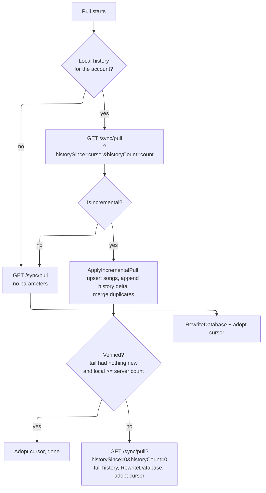

# Incremental history sync (Stage 1)

## 1. Why

`/sync/pull` used to return the **complete** account data on every pull: all songs *and the whole
listening history*. The history grows with every played song (21k entries in the reference database and
climbing forever), so the pull payload, the server response time and the amount of data every client
downloads on every startup grew without bound. The goal of Stage 1 is a pull whose steady-state payload
is **bounded forever**, without giving up the self-healing properties of the full snapshot.

Stage 1 keeps the **songs complete** (small, bounded by the library; clients reconcile them) and makes
the **history incremental**: a client tells the server where it left off and receives only what is new.

## 2. Protocol

```
GET /v1/sync/pull?historySince=<cursor>&historyCount=<local count>
```

Both parameters are optional, so older clients keep the old behaviour (complete history) and newer
clients still work against an older server (the extra response fields are simply absent):

| Parameter | Meaning |
|---|---|
| `historySince` | Highest history **sequence** the client already holds. `0`/absent = no cursor. |
| `historyCount` | How many history entries the client holds for the account (used for the zero-download bootstrap). |

The response (`SyncPullResponse`) gained four optional fields:

| Field | Meaning |
|---|---|
| `IsIncremental` | `HistoryEntries` is a delta/tail to **append** (deduplicated by primary key) instead of the full history to replace. |
| `HistorySequence` | The server's history cursor at response time; the client stores it. |
| `TotalHistoryCount` | Entries the account has server-side; the client uses it to detect that it is *missing* entries. |
| `ResyncRequired` | The server could not honour the cursor (e.g. restored database) - do a full pull. |

### Server decision table

| Request | Response |
|---|---|
| `historySince > 0` and `<= max` | Entries with `Sequence >= historySince`, ascending, `IsIncremental = true`. |
| `historySince > max` (client ahead of server) | Full history, `ResyncRequired = true`. |
| no cursor, `historyCount >= TotalHistoryCount` | **Bootstrap**: only the newest `50` entries as a verification tail, `IsIncremental = true`. |
| no cursor, otherwise | Full history, `IsIncremental = false` (old behaviour). |
| params absent (old client) | Full history, `IsIncremental = false`. |

`>=` (instead of `>`) is deliberate: two votes racing can produce entries that share a sequence, and an
inclusive cursor guarantees they can never be skipped. Clients deduplicate by their primary key
`(UserId, SongId, Date)`, so re-sent entries are harmless.

## 3. The sequence column (server only)

The cursor is the **server-only shadow property** `SongHistoryEntries.Sequence` - a shadow property, not
a DTO member, so **client databases keep their schema unchanged**.

* Assigned in application code (`SongHistorySequencer`), one per user and monotonically increasing:
  `max(sequence of that user) + 1` at `/sync/vote`, `/sync/init` (batch) and when the duplicate heal
  moves history rows onto a kept row.
  *Application* assignment (instead of an identity column) is what makes it work identically on
  PostgreSQL and SQLite: SQLite cannot auto-generate values for non-key columns.
* Existing rows are **backfilled once** in date order (`ROW_NUMBER() OVER (PARTITION BY "UserId" ...)`,
  guarded by `WHERE "Sequence" = 0`), so an existing database immediately has a meaningful cursor.
* Created by the EF migration `20260920120000_AddSongHistorySequence` (idempotent `IF NOT EXISTS` SQL)
  **and** ensured at server startup, so a server started without applying the migration still works.
  The migration file carries the `[Migration]`/`[DbContext]` attributes itself.

### Interaction with song library migrations and the duplicate heal

* **Rename migrations never touch history**: they only change `UpvotedSong.Name`, and history rows are
  keyed by `SongId`, so they stay valid. Nothing to propagate.
* **Delete migrations** remove the song row, and the server's cascade removes its history. Clients do
  not need to hear about that (see orphans below).
* **The duplicate heal** moves history onto the canonical row. Moved entries get a **fresh sequence**,
  so incremental clients (which are already past the old cursor) still receive them.

## 4. Client behaviour



* The cursor is stored **per account** in the client's own config
  (`ConfigData.SyncHistorySequences`), never in the shared `.song-library.music-player-config` file -
  that file is shared between devices through the NAS, while the cursor describes *this* local database.
* **Zero-download bootstrap**: a client that has history but no cursor (first start after the upgrade)
  asks with `historyCount`; the server answers with only the newest 50 entries. If none of them is new
  locally *and* the local history is not smaller than the server's, the client adopts the cursor without
  downloading the history at all. Otherwise it falls back to a full pull.
* **Orphans are kept on purpose.** History whose song no longer exists locally is harmless: no code path
  requires the song of a history entry to exist (the history views use null-safe lookups, the dxmg
  "recently upvoted" window skips entries without a song, and `SaveCurrentSongToHistory` guards its
  lookups). The only place that would break is `/sync/init`, which must not send history for songs that
  are not part of the upload - both clients now filter that.
* **Fallback rules** (all of them end in a full pull, i.e. today's behaviour):
  * `ResyncRequired` (server rolled back / restored),
  * `local history < TotalHistoryCount` (entries are missing - orphans can only make it *larger*),
  * the bootstrap tail contained something new,
  * any exception while applying,
  * the response was a delta/tail - the client then fetches the full history explicitly with
    `historySince=0&historyCount=0`.

## 5. What this does and does not bound

| Direction | Before | After |
|---|---|---|
| Pull response, per pull | songs + **entire history** | songs + delta (usually a handful of entries) |
| Pull response, first pull after upgrade | songs + entire history | songs + 50 entries (bootstrap) |
| Pull response, fresh client / account | songs + entire history | songs + entire history (unavoidable: it has nothing) |
| Vote / volume requests | one entry | unchanged |
| `/sync/init` upload (account bootstrap only) | songs + **entire local history** | unchanged - still a full upload |

`client_max_body_size` in nginx limits **request** bodies, so the pull (a GET) was never what that
setting protected; the growth that mattered there is the `/sync/init` upload and, for large libraries,
the songs list. Stage 1 removes the unbounded *history* growth from the pull entirely. What can still
grow, and the follow-up work if needed:

1. **Songs remain complete in every pull.** Bounded by the library size (~1 MB per 3.5k songs), not by
   listening time. Stage 2 would send only changed songs, which needs a per-song version/`UpdatedAt`
   plus tombstones so clients can still learn about deletions.
2. **`/sync/init` still uploads the whole local database**, including all history. It only runs when the
   server account is empty (new account, server reset). Options: cap the history part, upload it in
   chunks, or rely on the song counters (which already carry the accumulated score/streak/likes/dislikes)
   and treat history as best-effort.

## 6. Deployment & compatibility

1. **Server first** (any order works, but this gives the benefit earliest): deploy, then either run
   `dotnet ef database update` or simply start the server - the startup ensure adds the column, the index
   and the backfill. Look for `Added the history sequence column and backfilled …`.
2. **Then the clients.** Old clients keep working against the new server (no parameters → full pull).
   New clients work against an old server (a missing cursor field means "full pull" and no cursor is
   stored, so the next pull tries the bootstrap again).
3. Rolling back the server is safe: clients then get full pulls again; the stored cursor is simply not
   used until a server that understands `historySince` answers again.

## 7. Cheat sheet

| Concern | Where |
|---|---|
| Sequence assignment, app-side cursor, column/index/backfill ensure | `MusicPlayerSyncServer/Database/SongHistorySequencer.cs` |
| Shadow property + index | `MusicPlayerSyncServer/Database/SongDbContext.cs` |
| Migration | `MusicPlayerSyncServer/Migrations/20260920120000_AddSongHistorySequence.cs` |
| Pull endpoint decision table | `MusicPlayerSyncServer/MusicPlayerSyncEndpointsV1.cs` (`/sync/pull`) |
| Heal assigns fresh sequences to moved history | `UpvotedSongDeduplicator.RemoveRowsWithHistory` |
| Response fields | `MusicPlayerSyncInterface/DTOs/Composites/SyncPullResponse.cs` |
| Avalonia apply + fallback | `DbWrapperService.ApplyIncrementalPull`, `SongSyncService.Pull` (+ `GetHistoryCursor`/`SetHistoryCursor`) |
| dxmg apply + fallback | `Persistence/Database/IncrementalPullApplier.cs`, `SyncManager.Pull` |
| Init payload never contains orphan history | `DbWrapperService.GetSyncInitRequest`, `SyncManager.Init` |
