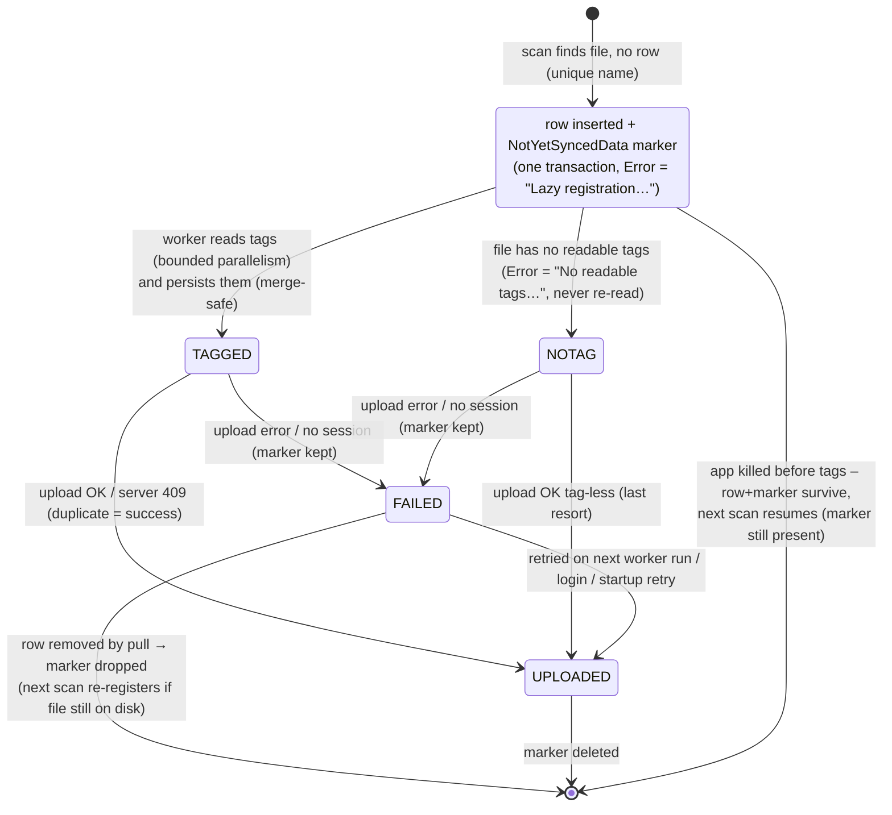
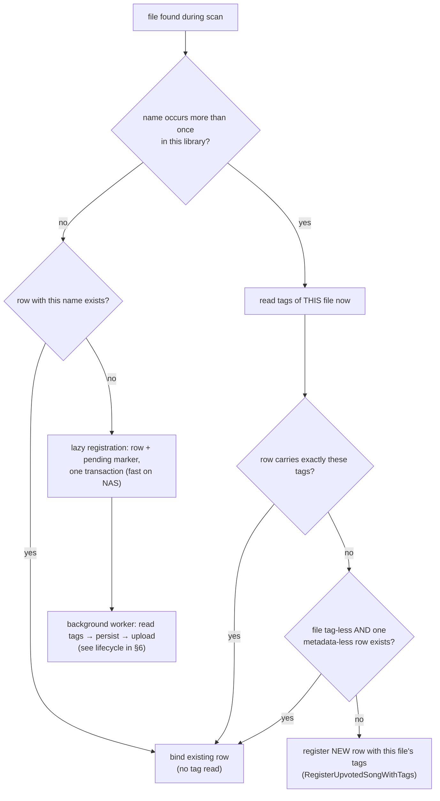

# Song Database Entry Deduplication & Sync Loading — Concept & Architecture

> Applies to the state of the code **after** the deduplication / lazy-scan feature was implemented.
> Related but separate feature (song library **file** migrations: rename/delete tracking, commit-point
> POST, state file) is documented in [song-library-migrations.md](song-library-migrations.md).
> This document is about **database rows**: how the same song can end up as several `UpvotedSongs`
> entries, how those are merged again, how they are prevented, and how the Avalonia client loads a big
> library fast on slow media (NAS).

## 1. The problem this feature solves

An `UpvotedSongs` row is identified by **one account** + **(file name, album, album artists)**. The
`SongId` is a GUID the **client** generates when it first sees the file, and the row only reaches the
sync server when the song is uploaded (`/sync/new-song`).

That leads to duplicates whenever the *same* physical song gets registered twice under different
`SongId`s:

* two clients of one account scan the same (NAS-shared) library and both register the song — each with
  its own `SongId`, both get uploaded because the server only deduped on `SongId`;
* a client registers a song **offline**, queues the upload, reconnects later and the upload succeeds
  although another client already registered the same file;
* a client registers the file **without reading its tags** while another client registered it *with*
  tags (the old Avalonia client never read tags; DXMG back-filled them).

Two kinds of duplicates exist:

| Kind | Rows | Provable without the file? |
|---|---|---|
| **Exact duplicate** (flavor 1) | Same `(UserId, Name, Artist, Album)`, i.e. identical stored tags (incl. both empty) | Yes — pure database data. |
| **Tag-completeness duplicate** (flavor 2) | Same `(UserId, Name)`, but one row carries the album/artist of the song while the other is metadata-less (`""`) | Only with an arbiter: the actual song file's tags (clients), or a *single tag signature* heuristic (server/without file). |

Untagged duplicates show up in statistics as two rows of the same song, and file→row resolution
(`ResolveUpvotedSongEntry`) used to **throw** `InvalidDataException` when several rows matched one file.

A second, related problem grew out of the profiling: on slow media (NAS + antivirus), reading the tags
of thousands of files during the first library scan took **minutes**, and a fresh account was unusable
for a long time.

## 2. Core ideas

| Idea | Meaning |
|---|---|
| **One song = one `(account, file name, album, artists)`** | This is the identity used everywhere: the unique DB index, the dedupe checks, the merge groups, and file matching. |
| **Merge = keep one canonical row, drop the rest** | The kept row is chosen by a deterministic rule that **never discards user-built data** (see §3). Its counters (score/likes/dislikes/streak/volume) stay **untouched** — they are the accumulated values of the row with the most data and may predate the history entries. The merged-away rows' `SongHistoryEntry` rows are **re-pointed onto the kept row** for the record (same-date duplicates dropped); only the oldest registration date is blended into the kept row, and mp3 metadata is copied onto it when the kept row was the data-carrying metadata-less one. |
| **Prevent at the server** | `/sync/new-song` rejects a second row of the same identity and returns the existing row as the **409 body**, so clients can remap queued data to it. |
| **Heal what slipped through** | The server merges duplicates of both flavors at **startup** (idempotent); clients merge again **after every pull**, so even an un-healed older server converges locally. |
| **Match must never throw** | `ResolveUpvotedSongEntry` never raises on duplicates anymore: same-name+same-tags rows resolve to the canonical row deterministically; a file whose tags no row carries is simply "not registered". |
| **Tags are read lazily on slow media** | The scan registers rows fast and **defers tag reading + upload** to a background worker. Rows get a durable pending marker, so an app kill at any point cannot lose work (§6). |
| **Uploads need a session** | The worker reads/persists tags regardless of login, but only *uploads* when a sync session exists; a later login kicks the upload pass. No 401 storms on first boot. |
| **Ambiguous file names are never lazy** | Files whose name occurs more than once in the library are resolved/registered strictly with their tags read immediately, so same-named *different* songs become distinct rows from the first scan (§7). |

## 3. The merge rules (shared, in `SongFileMatching`)

All merge/canonical logic lives in the shared interface project so server, clients and the file
matching agree on one definition.

**Canonical selection** (`ChooseCanonicalEntry`) orders candidate rows:

1. rows carrying **user-built song data** (`CarriesSongData`: score, likes/dislikes, streak, analyzed
   volume) win over rows without it — that data is accumulated from user input over time and cannot be
   recreated, while metadata can be copied onto the winner afterwards. *(Without this rule a fresh
   tagged-but-empty row would win over the old metadata-less row that holds the real listening
   history — exactly the data loss the feature must prevent.)*
2. among data-carrying rows: more votes first, then the bigger streak, then an analyzed volume;
3. among rows **without** data: rows whose stored tags exactly match the arbitrating file win first
   (only when file tags were given), so fresh duplicates keep the properly tagged entry;
4. synced rows (`UserId != ""`) over purely local rows (`UserId == ""`);
5. higher `Score`;
6. older `DateAdded` (non-null before null);
7. smaller `SongId` (fully deterministic last resort).

**Merge** (`MergeSameSongEntries`): returns `(Keep, Remove)`. The kept row keeps its own counters and
volume — they are **never recomputed from history** (scores can predate the history entries, so a
replay would lose data). The merged-away rows are removed, but their `SongHistoryEntry` rows are
**re-pointed onto the kept row** for the record (entries colliding with the kept row's history — same
account + same date — are the same listening event recorded twice and dropped). Only the registration
date is additionally blended into `Keep`:

* `DateAdded` = oldest date of the group (null stays null).

`Volume` deliberately keeps the canonical row's own value: it is a per-file measurement of the very
song, not cumulative user data, so there is nothing to merge — the kept (data-carrying) row's volume
is the right one. Because the counters are kept as-is while extra history rows may be moved onto the
row, the history can intentionally contain more events than the counters sum up to (votes from merged
rows, or from before history recording existed) — that is by design: the counters are the
authoritative accumulated state, the history is the (best-effort) record.

**Metadata adoption** (`TryGetTagsToAdoptOnto`): when the kept row is the metadata-less one (it won
because it carries the song data) and another row of the group carries the album/artist of the
arbitrating file, the merge **adopts that metadata onto the kept row** — the metadata ends up "where
it belongs" and the data row survives. Adopting happens *after* the tagged loser row was removed and
saved (the caller first drops the loser, then updates the kept row), so the adoption can never collide
with the loser's unique `(name, artist, album)` identity.

## 4. Data model & durable state

**No schema changes were needed.** Everything rides on existing tables:

* `UpvotedSongs` — the unique index `(UserId, Name, Artist, Album)` already declared in the shared
  `Database/Model.cs`. It was never actually enforced on the live server DB (duplicates predated it),
  which is why the startup heal **creates it if missing** (`CREATE UNIQUE INDEX IF NOT EXISTS …`).
* `NotYetSyncedData` (client only) — reused as the **pending marker** for lazily registered songs:
  `Endpoint = "/sync/new-song"`, `BelongedToSongId = <row SongId>`, `Body = <serialized row>`.
  Its `Error` column carries the marker state:

| `Error` value | Meaning |
|---|---|
| `"Lazy registration: waiting for tag read + upload."` | Row inserted, tags not read yet — owned by the background worker, skipped by the startup retry. |
| `"No readable tags (uploaded without tags when possible)."` | Tag read attempted, file genuinely tag-less/unreadable — uploaded tag-less as a last resort, not re-read every scan. |
| real HTTP/network message | Upload was attempted and failed (offline, 5xx…) — retried on the next worker run or by the startup retry. |

Row **and marker are written in one SQLite transaction** (`AddNewUpvotedSongLazy`), so a crash cannot
produce a row without a marker or vice versa.

## 5. Where everything lives (architecture map)

```
music-player-sync-interface              (git submodule, checked out identically in all 3 repos)
├── SongFileMatching.cs                  identity + dedupe + canonical/merge rules + tolerant
│                                        file→entry resolution (pure, no TagLib, no DB)
└── Database/Model.cs                    unique index (UserId, Name, Artist, Album) + comment

music-player-sync-server
├── MusicPlayerSyncServer/MusicPlayerSyncEndpointsV1.cs   /v1/sync/new-song dedupe (409 + canonical row),
│                                                         incl. metadata-less upload absorption + race fallback
├── MusicPlayerSyncServer/Database/UpvotedSongDeduplicator.cs   startup heal: two-pass merge per user,
│                                                         moves loser history onto the kept row,
│                                                         keeps counters, ensures unique index
└── MusicPlayerSyncServer/Program.cs     runs the heal + index ensure at every startup (log line)

music-player-dxmg-port (older client)
└── MusicPlayerSyncInterface/…           mirrored copy of the shared rules only. Its SyncManager already
                                         treats 409 uploads as success (queue entry dropped). No client-side
                                         merge/lazy machinery yet — protected by the server heal + dedupe.

music-player-avalonia-port (newer client)
├── Services/Infrastructure/SongSyncService.cs     worker (tag+upload, session-aware), Init retry rules,
│                                                  body refresh, Pull() state messages + merged count,
│                                                  upload 409 → RedirectQueuedEntriesToSong
├── Services/Infrastructure/DbWrapperService.cs    fast name-scoped lookup, registration (eager/lazy),
│                                                  pending markers, merge-safe tag apply, post-pull merge,
│                                                  queued-entry redirect, tag read helper, marker constant
├── Services/Song/SongVotingService.cs   registration lock + RegisterNewUpvotedSong(defer…),
│                                        RegisterUpvotedSongWithTags (strict identity)
├── Services/Song/SongPlaybackService.cs parallel scan, monotonic progress, ambiguous-name strict path,
│                                        kicks the background worker with the file map
├── Persistence/Database/SongDbContext.cs + SqlitePragmasInterceptor.cs   WAL, synchronous=NORMAL,
│                                        busy_timeout on every SQLite connection
├── Helpers/HelperFuncs.cs               TagLib.File is disposed after reading tags (handle/finalizer leak)
└── Views/Options/OptionsView.cs         already mirrors SongSyncService.State into the label; kicks the
                                         worker after a successful login+pull
```

### Component entanglement

```mermaid
%%{init: {"theme": "base", "themeVariables": {"textColor": "#111111", "primaryTextColor": "#111111", "lineColor": "#5c6773", "edgeLabelBackground": "#ffffff"}, "flowchart": {"defaultRenderer": "elk"}}}%%
flowchart LR
    subgraph SERVER["music-player-sync-server"]
        EP["MusicPlayerSyncEndpointsV1.cs<br/>POST /v1/sync/new-song (dedupe, 409 + canonical row)"]
        HEAL["Database/UpvotedSongDeduplicator.cs<br/>startup heal + index ensure"]
        PROG["Program.cs (startup hook)"]
    end

    subgraph INTERFACE["MusicPlayerSyncInterface (submodule, same repo in all 3 top-level repos)"]
        FM["SongFileMatching.cs<br/>identity · canonical · merge · resolve"]
        MOD["Database/Model.cs<br/>unique index (UserId, Name, Artist, Album)"]
    end

    subgraph DXMG["music-player-dxmg-port"]
        DX["SyncManager.cs (409 upload = success)<br/>+ mirrored SongFileMatching"]
    end

    subgraph AVALONIA["music-player-avalonia-port"]
        SYN["SongSyncService.cs<br/>worker · Init retry · Pull states"]
        DBW["DbWrapperService.cs<br/>lazy registration + markers · post-pull merge · redirect"]
        VOT["SongVotingService.cs<br/>registration lock · strict tag registration"]
        PLB["SongPlaybackService.cs<br/>parallel scan · ambiguous names · worker kick"]
        SDB["SongDbContext + SqlitePragmasInterceptor.cs<br/>WAL tuning"]
        OPT["Views/Options/OptionsView.cs"]
    end

    MARK["NotYetSyncedData rows<br/>(durable pending markers)"]
    DB["local song.db"]
    SERVERDB["server DB (UpvotedSongs)"]
    FILES["song library folder (NAS)"]

    FM -.->|"pure rules"| EP
    FM -.->|"pure rules"| HEAL
    HEAL -->|"merges + index"| SERVERDB
    PROG --> HEAL
    MOD -->|"index definition"| SERVERDB

    EP -->|"writes rows"| SERVERDB
    EP -->|"409 body = existing row"| SYN

    SYN -->|"markers / queue rows"| MARK
    SYN -->|"upload with tags"| SERVERDB
    SYN -->|"tag reads (worker)"| FILES
    SYN -->|"post-pull merge"| DBW
    DBW -->|"row + marker, one txn"| DB
    DBW -->|"merge reads file tags"| FILES
    VOT -->|"registers rows"| DBW
    PLB -->|"kicks worker (file map)"| SYN
    PLB -->|"parallel resolution + strict names"| DBW
    PLB -->|"enumerates files"| FILES
    SDB -->|"WAL pragmas on open"| DB
    OPT -->|"login/pull → kick worker"| SYN
    OPT -->|"mirrors State label"| SYN

    classDef server fill:#ced4da,stroke:#495057,color:#111111;
    classDef iface fill:#ffe066,stroke:#b58900,color:#111111;
    classDef dxmg fill:#a5d8ff,stroke:#1864ab,color:#111111;
    classDef avalonia fill:#b2f2bb,stroke:#2b8a3e,color:#111111;
    classDef runtime fill:#ffa8a8,stroke:#c92a2a,color:#111111;
    class EP,HEAL,PROG server;
    class FM,MOD iface;
    class DX dxmg;
    class SYN,DBW,VOT,PLB,SDB,OPT avalonia;
    class MARK,DB,SERVERDB,FILES runtime;

    style SERVER fill:#f8f9fa,stroke:#868e96,stroke-width:2px,color:#212529;
    style INTERFACE fill:#fff9db,stroke:#e0a800,stroke-width:2px,color:#212529;
    style DXMG fill:#e7f5ff,stroke:#1c7ed6,stroke-width:2px,color:#212529;
    style AVALONIA fill:#ebfbee,stroke:#2f9e44,stroke-width:2px,color:#212529;
```



> Reading the diagram: colored **group borders** mark the repositories (grey = server, gold = shared
> interface, blue = DXMG, green = Avalonia); nodes are tinted in the same hue. Red nodes are runtime
> artifacts (databases, library files). Solid edges are code dependencies; dashed edges are rules/ops
> relations; edge labels say what flows.

## 6. The lazy tag/upload lifecycle (Avalonia)

This is the piece that makes a fresh account on a NAS usable. The durable marker is the state machine:



Crash-safety invariants:

1. **Row + marker are atomic** — the scan cannot create an un-tracked row.
2. **Tags are persisted before the upload, but the marker is only removed after the upload succeeded
   (or the server answered 409)**. Every crash window therefore just leaves the marker for a harmless
   retry; the server never receives a lazy row without its tags (except the deliberate no-tags case).
3. **Uploads require a session** (`client != null`). Without one the worker tags rows and stops; a
   401/403 stops the rest of the run (no 401 flood). The Options login flow kicks the worker afterwards.
4. The startup retry (`Init`) **skips** markers whose row is still tag-less (the worker owns them),
   drops markers whose row vanished, and otherwise refreshes the queued body from the current row
   (tags/renames never stale).

```mermaid
sequenceDiagram
    autonumber
    participant Scan as SongPlaybackService scan
    participant DB as local db
    participant Worker as SongSyncService worker
    participant Files as song library (NAS)
    participant Server as sync server

    Note over Scan: first boot, no login yet
    Scan->>DB: resolve each file; insert row + marker<br/>(one transaction, no tag read)
    Scan->>Worker: ProcessPendingSongUploadsInBackground(filesByName)
    Worker->>Files: read tags (parallelism 4)
    Worker->>DB: persist tags on rows (merge-safe);<br/>no session → markers stay
    Note over Worker: user logs in later (Options)
    Server-->>Scan: login + pull OK
    Options->>Worker: kick again (uploads: True)
    Worker->>Server: POST /sync/new-song (row WITH tags)
    Server-->>Worker: 200 / 409 (already exists)
    Worker->>DB: remove marker (uploaded / deduped)
```

## 7. Scan resolution: fast path, ambiguous names, and why they differ

During `UpdateAvailableSongPaths` every file is resolved against the DB:

* **unique name** → `GetUpvotedSongByFullPath` (name-scoped SQLite query; returns immediately for 0/1
  rows). New rows are inserted **lazily**.
* **ambiguous name** (the name occurs in more than one library path — computed once per scan, no file
  IO) → tags are read **now** and `CreateAmbiguousNameAvailableSong` decides:
  1. an existing row carries exactly these tags → bind to it (copies of one song share the row);
  2. file has no readable tags and a metadata-less row of that name exists → bind to it;
  3. otherwise it is a **different same-named song** → register a new row **with** its tags
     (`RegisterUpvotedSongWithTags` — never merged by name alone).

Consequence: same-named *different* songs get distinct, correctly tagged rows from the very first scan
(even logged out), and the lazy worker never has to guess which copy a row belongs to.



## 8. Server behavior in detail

All in `MusicPlayerSyncEndpointsV1.cs` → `POST /v1/sync/new-song`:

1. `SongId` already exists (any user) → plain `409`.
2. Exact identity `(UserId, Name, Artist, Album)` exists → **`409` whose body is the existing row**, so
   the client can remap queued votes etc. (`Results.Json(existing, statusCode: 409)`).
3. Upload is **metadata-less** and rows of the same name all share one tag signature → treated as a
   duplicate of that tagged row (`409` + row). This absorbs stale tag-less uploads from old clients
   instead of creating flavor-2 rows.
4. `DbUpdateException` (two clients raced while the unique index is missing) → re-query by identity →
   `409` + row, or a generic problem result.

`Database/UpvotedSongDeduplicator.cs` (startup, via `Program.cs`):

* **Pass 1 — exact duplicates**: group by `(UserId, Name, Artist, Album)`, keep canonical, remove the
  rest. Their `SongHistoryEntry` rows are **re-pointed onto the kept row** (same-account + same-date
  entries are the same listening event recorded twice and are dropped). The history moves are saved
  BEFORE the rows are deleted, so the database cascade can never remove them. The kept row's counters
  are left untouched — they are the accumulated values of the row with the most data and can predate
  the history entries.
* **Pass 2 — tag-completeness duplicates**: group by `(UserId, Name)`; when all *tagged* rows of the
  name share one tag signature, merge the rows keeping the **data-carrying** canonical row (score/
  history always survives; the merged-away row's history is moved onto it the same way) and adopt the
  file's metadata onto it if the kept row was the metadata-less one. Genuinely different same-named
  songs carry different signatures and are never merged.
* Then ensure the unique index exists (`CREATE UNIQUE INDEX IF NOT EXISTS …`, works on PostgreSQL and
  SQLite). Idempotent; logs `Healed N duplicate …` (incl. how many history entries were moved) or a
  no-op message.

## 9. Client implementations — where the logic sits (Avalonia)

| Member | Responsibility |
|---|---|
| `SongFileMatching` (interface) | Pure identity/merge/resolution rules. |
| `DbWrapperService.Context.GetUpvotedSongByFullPath` | Fast name-scoped lookup; tags only read to disambiguate 2+ same-name rows. |
| `DbWrapperService.Context.AddNewUpvotedSongLazy` | Row + pending marker in one transaction (scan path). |
| `DbWrapperService.Context.AddNewUpvotedSong(songPath, tags)` | Eager registration with optional pre-read tags (runtime path). |
| `DbWrapperService.Context.TryApplyTagsToSong` | Persist tags; if the identity is already taken by another row, remove the tag-less duplicate instead of updating (merge-safe vs. the unique index). |
| `DbWrapperService.Context.MergeDuplicateUpvotedSongs` | Post-pull merge: pass 1 exact, pass 2 tag-completeness. When a library is available the whole folder is enumerated **once** into a name→files map (per-group recursive walks were the original bottleneck); same-named files are then checked against the tags so a genuinely different same-named file blocks the merge. |
| `DbWrapperService.Context.RewriteDatabase` | Wipe + rewrite from the pull, then merge; returns how many duplicates were merged (used for the UI message). |
| `DbWrapperService.Context.RedirectQueuedEntriesToSong` | Rewrites queued votes/volume/upload bodies + `BelongedToSongId` when a `409` gives the canonical `SongId`. |
| `SongVotingService.RegisterNewUpvotedSong(songPath, deferTagReadingAndUpload)` | Eager vs. lazy registration under the registration lock (serializes check+insert for parallel scans). |
| `SongVotingService.RegisterUpvotedSongWithTags` | Strict registration for ambiguous names (identity-only match). |
| `SongSyncService.ProcessPendingSongUploadsInBackground` | The worker (parallelism 4); see §6. |
| `SongSyncService.Init` retry | Lazy-marker rules + body refresh from the current row; drops stale markers; 404-vote heuristic. |
| `SongSyncService.Pull` | Sets `State = "Merging duplicate song entries after the pull…"` and ends with `Pull Succeeded! (merged N …)` — the Options view mirrors `State` live. |
| `SongPlaybackService.UpdateAvailableSongPaths` | Parallel scan (DOP 2–16), monotonic progress, ambiguous-name set, worker kick. |
| `SqlitePragmasInterceptor` | WAL + `synchronous=NORMAL` + busy timeout on every SQLite connection (fast commits; concurrent writers wait instead of failing). |
| `HelperFuncs.GetAlbumAndArtistsFromSong` | Disposes the `TagLib.File` (previously leaked a file handle per read → finalizer/GC churn). |

DXMG is deliberately not mirrored for the client-side parts: the server heal/dedupe keeps its DB
consistent, and its `SyncManager` already treats upload `409` as success. Porting the lazy marker
machinery to DXMG would follow the same lifecycle if ever wanted.

## 10. Race conditions handled

| Race | Protection |
|---|---|
| Two files of the same song race during a parallel scan | Registration lock + re-check; first insert wins, second maps to the same row. |
| Two clients upload the same song simultaneously | Server identity check + `DbUpdateException` fallback → second gets `409` + canonical row. |
| Retried upload after lost response | Server returns the existing row → client treats `409` as success and drops the marker/queue entry. |
| App killed between any worker steps | Row+marker are atomic; markers are only removed after a successful/409 upload → resume on next scan/login. |
| Not logged in during the scan | Worker tags rows but leaves markers (`uploads: False`); a login kick uploads them; 401/403 stops the run early. |
| Pull rewrites the DB while lazy rows/markers exist | Markers whose row vanished are dropped; the song is re-registered by the next scan if the file is still on disk. |
| Backfill tags would collide with an existing row | `TryApplyTagsToSong` removes the tag-less duplicate (never an index violation). |
| Post-pull merge vs. a genuinely different same-named file | Library file check (when available) blocks the merge; without a library only the single-signature rule decides (like the server). |
| Same-named different-tag songs on first scan | Ambiguous-name strict path registers each with its own tags from the start. |

## 11. Intentional semantics & known limitations

* **The row with user data always wins and keeps it.** Canonical selection is data-first (see §3): a
  metadata-less row that accumulated score/likes/dislikes/streak/volume over time survives a merge
  against a fresh tagged-but-empty row, the mp3 metadata is adopted onto it, and its counters stay
  untouched. The merged-away row's history entries are re-pointed onto it for the record (only
  genuinely identical *duplicate* listening events — same account + same date recorded on two rows of
  the same song — are discarded).
* The server heal and the client merge only join rows **they can prove** are the same song; rows that
  differ in *both* tags (genuinely different same-named songs) are never merged.
* **Why a pull can still report "Merged N … duplicate(s)" repeatedly:** the post-pull merge runs on the
  rows the *server* delivered. If the server still holds the legacy flavor-2 pairs (tag-less rows
  uploaded by old clients), every pull re-delivers them and the local merge absorbs them again. The
  fix is server-side: restart the sync server with the heal (`UpvotedSongDeduplicator`, pass 2 merges
  single-signature flavor-2 pairs and adopts the metadata onto the data-carrying row). Once the heal
  ran, the pairs are gone from the server and the merges stop. Nothing in the client worker recreates
  them.
* Votes/volume changes queued against a song before its lazy upload finished can 404 once; they stay
  queued and are synced on the next startup retry (not lost).
* Files whose tags change on disk can effectively become "new" songs from the DB's point of view
  (tags are part of the identity) — pre-existing behavior, unchanged.
* Metadata-less rows are **legitimate**: several songs intentionally carry no album/artist (old clients
  pruned metadata that was redundant with the file name). Such rows are never touched unless the same
  file name also has a provably identical (single-signature) tagged row.

## 12. Incidental fixes made along the way (worth knowing when debugging)

* **SQLite WAL tuning** (`SqlitePragmasInterceptor`): default `DELETE` journal mode fsynced the journal
  *and* the DB per write transaction, making thousands of small commits (scan registration, votes)
  take tens of ms each — measured as `Monitor.Enter_Slowpath` dominating a 7-minute load. WAL +
  `synchronous=NORMAL` cut commits to sub-ms.
* **TagLib leak**: `GetAlbumAndArtistsFromSong` never disposed `TagLib.File` → thousands of open file
  handles until GC/finalizers, causing stalls during and after the scan. Fixed with `using`.
* **EF Core 8 on .NET 10 cannot parameterize `array.Contains(...)`** inside a LINQ-to-Entities query
  (it compiles a `ReadOnlySpan` closure and throws). All such queries were rewritten to per-id
  comparisons or in-memory filtering (server heal, client merge, `RenameQueuedSongUploads`).
* The scan's per-group merge used to call `FindSongFilesByName` (a full recursive NAS walk) for *every*
  duplicate group; the merge now enumerates the library once into a name→files map.
* Per-file resolution used to load the whole user's rows from SQLite per file; it now filters by file
  name in SQL and returns immediately for 0/1 rows.
* Startup "SongId  not found!" `InvalidDataException` traces came from visualization/volume/MPRIS code
  querying the currently playing song's row while nothing was playing yet (or right after a pull
  replaced the rows). Those consumers are now guarded (null/empty `SongId` → skip) and use the
  tolerant `GetUpvotedSongByIdOrNull` lookup.
* Parallel progress is a completion counter that is only ever raised under a lock — no wobble.

## 13. Deploying / operating notes

* The `MusicPlayerSyncInterface` submodule carries the shared rules; all three checkouts must be kept
  identical (commit/push from one, update the others via git) before the top-level repos build.
* Server: just rebuild + restart. Startup logs either `Healed N duplicate upvotedSong row(s)…` or the
  no-op message, and ensures the unique index.
* First pull after the heal: clients merge leftovers locally (`Pull Succeeded! (merged N …)` in the
  Options label), then statistics show one row per song.
* Performance context: scanning is IO-bound only for files whose tags are needed (ambiguous names, and
  the background worker at parallelism 4). Unique-name files on an existing DB are resolved by
  name-filtered queries alone.
* Rebuilding: DXMG and Avalonia must be built on a machine with normal tooling (Avalonia's build
  telemetry writes to `%LOCALAPPDATA%`).

## 14. Quick symbol cheat-sheet for grepping

| What | Where |
|---|---|
| Identity / canonical / merge / resolution rules | `SongFileMatching.cs` (interface) |
| Unique-index definition + rationale comment | `Database/Model.cs` (interface) |
| Upload dedupe endpoint | `MusicPlayerSyncEndpointsV1.cs` (server) → `/sync/new-song` |
| Startup heal + index ensure | `Database/UpvotedSongDeduplicator.cs` + `Program.cs` (server) |
| Pending-marker constant | `DbWrapperService.PendingTagReadError` |
| Lazy registration (row + marker) | `DbWrapperService.Context.AddNewUpvotedSongLazy` |
| Background worker | `SongSyncService.ProcessPendingSongUploadsInBackground` |
| Post-pull merge | `DbWrapperService.Context.MergeDuplicateUpvotedSongs` + `RewriteDatabase` |
| Merge-safe tag persist | `DbWrapperService.Context.TryApplyTagsToSong` |
| History re-point before row delete (server) | `UpvotedSongDeduplicator.RemoveRowsWithHistory` (counters kept) |
| History re-point before row delete (client) | `DbWrapperService.Context.RemoveUpvotedSongRows(keep, remove)` (counters kept) |
| Data-row detection / tag adoption helpers | `SongFileMatching.CarriesSongData`, `SongFileMatching.TryGetTagsToAdoptOnto` |
| Data-carrying-row-aware canonical pick | `SongFileMatching.ChooseCanonicalEntry` (rules 1–7 in §3) |
| Queued-entry redirect on 409 | `DbWrapperService.Context.RedirectQueuedEntriesToSong` |
| Strict registration for ambiguous names | `SongVotingService.RegisterUpvotedSongWithTags` |
| Parallel scan / ambiguous names / worker kick | `SongPlaybackService.UpdateAvailableSongPaths` |
| SQLite tuning | `Persistence/Database/SqlitePragmasInterceptor.cs` + `SongDbContext.cs` |
| Progress label during pull/merge | `SongSyncService.Pull` states + `Views/Options/OptionsView.cs` |
