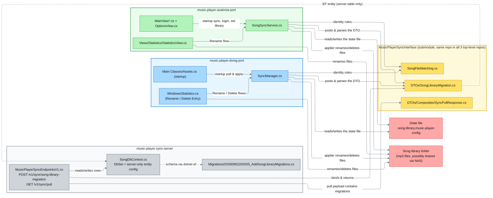
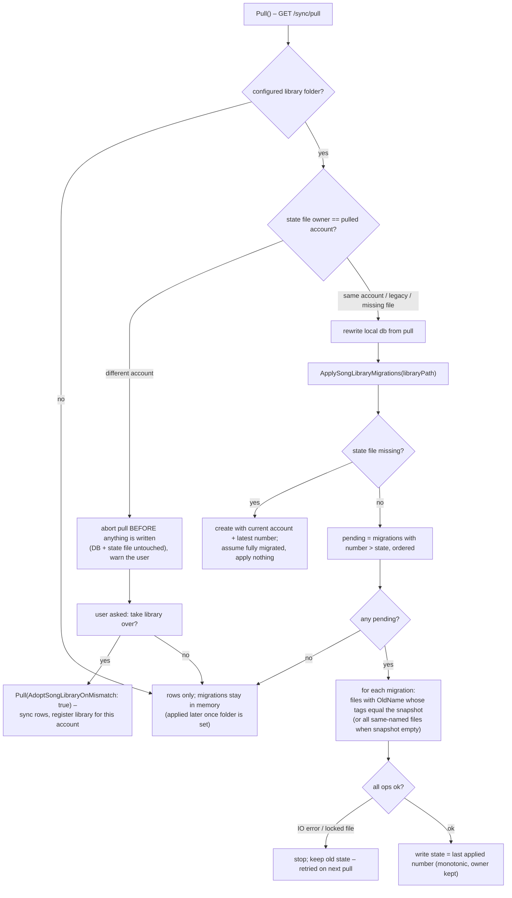

# Song Library Migrations — Concept & Architecture

> Applies to the state of the code **after** the song-library migration feature was implemented.
> Related but separate feature (song deduplication/merging on account connect + lazy/parallel loading,
> e.g. `SongSyncService.ProcessPendingSongUploadsInBackground`) is **not** part of this document.

## 1. The problem this feature solves

Every client keeps a local SQLite `song.db` mirroring the server's `UpvotedSongs` table for the logged-in
account. Each entry points at a song **file** in the client's *song library folder*. The mapping
entry → file is `(file name, album, album artists)` — the file name including the extension is the
primary key of the mapping, tags disambiguate.

Multiple clients of the same account may point at the **same** library folder (e.g. a NAS mount) or at
different folders (private copies, partially filled libraries). When one client renames or deletes a
song file, every other client must end up with:

1. a consistent `UpvotedSongs` row (same `SongId`, new name — or gone), and
2. a consistent library: the *song's own files* renamed/deleted, while **other songs that merely share
   the file name must not be touched**.

Before this feature, a rename in one client was purely local (DXMG even renamed its local row + file with
no server involvement), so the next pull reverted the row name and other clients silently desynced.

## 2. Core ideas

| Idea | Meaning |
|---|---|
| **Migration** | One record of "the file of `UpvotedSong` entry *X* was renamed to Y / deleted". Carries `SongId` plus snapshots of the entry's `Album`/`Artist`, so it always refers to one exact song, never to "every file with that name". |
| **Per-user, ordered stream** | Each account has its own migration numbering (`1..n`). The server assigns numbers (`max+1`) so ordering is total and gapless per account. |
| **POST is the commit point** | A rename/delete only counts when the client has a working server connection and the POST succeeded. The server applies the DB change **and** records the migration in one transaction. If the POST fails, the client aborts and changes nothing locally (no offline queueing). |
| **Pull transports migrations** | `GET /sync/pull` returns the account's rows/history **plus** the full migration list. There is no push/websocket; clients catch up on the next pull. |
| **State file = high-water mark + owner** | `.song-library.music-player-config` inside the library folder stores *which account* the library belongs to and *the number of the last applied migration*. Only migrations with `number > state` are applied, in order. Because the file lives in the library folder, NAS-sharing clients share it — which is why the account matters (two accounts' streams are not comparable; a single integer only works for one owner). |
| **Rows follow the server, files follow the applier** | The DB side of a migration is executed on the server at POST time; every pull rewrite distributes it. The *file* side is executed locally by each client's applier (`ApplySongLibraryMigrations`), because the server cannot touch filesystems. |
| **Files are matched by tags, not by name alone** | A file is only renamed/deleted if its tags equal the migration's `Artist`/`Album` snapshot (or the snapshot is empty — then the file name is all the identity there is). Same-named *different* songs are never touched. |

## 3. Data model

### 3.1 Migration record (`SongLibraryMigration`)

Defined in the shared interface project (submodule), used as EF entity on the server and as a plain DTO
on the clients. Wire format is JSON; `MigrationType` is serialized numerically (works with both
System.Text.Json and Newtonsoft).

| Field | Set by | Meaning |
|---|---|---|
| `MigrationId: Guid` | client | Unique id; the server dedupes retried requests on `(UserId, MigrationId)`. |
| `UserId: string` | server (auth) | Owning account (Keycloak subject id). |
| `SongId: Guid` | client | The exact `UpvotedSong` entry this migration refers to. Required. |
| `MigrationNumber: int` | server | Per-user sequence number (`max+1`). |
| `MigrationType` | client | `Rename` or `Delete`. |
| `OldName: string` | client | Old file name incl. extension (for Delete: the name of the file to remove). |
| `NewName: string` | client | New file name (empty for Delete). |
| `Album: string` | **server** | Snapshot of the entry's album at POST time. |
| `Artist: string` | **server** | Snapshot of the entry's artists (`" + "`-joined), at POST time. |

### 3.2 Server table (`SongLibraryMigrations`)

Only the **server** persists migrations. The client databases deliberately do **not** get this table
(their state lives in the config file), which is why the entity configuration lives in the server's
`SongDbContext`, **not** in the shared `Model.OnModelCreating`.

* EF migration: `MusicPlayerSyncServer/Migrations/20260902202025_AddSongLibraryMigrations.cs`
  (plus Designer + updated snapshot). Columns: `MigrationId` (PK), `UserId` (FK → `Users`,
  `NoAction`), `SongId` (plain Guid column — deliberately **no FK**, because delete migrations must
  outlive the row they delete), `MigrationNumber`, `MigrationType` (stored as string via
  `HasConversion<string>()`), `OldName`, `NewName`, `Album`, `Artist`.
* Unique index `(UserId, MigrationNumber)` — this is what makes number assignment race-safe.
* No FK on `SongId` to `UpvotedSongs`: the POST deletes the row and inserts the migration in one
  `SaveChanges`; a FK would either block the delete or cascade away the migration.

### 3.3 State file (`.song-library.music-player-config`)

Located in the **root of the song library folder**. File name constant:
`SONG_LIBRARY_CONFIG_FILE_NAME` in `SyncManager` (DXMG) / `SongSyncService` (Avalonia).

```
<account user id>          <- owner of this library
<migration number>         <- last migration applied to this library
```

* Missing or unparseable file → treated as *fully migrated* for the current account: the client
  **creates** the file with the current account + the latest known number and applies nothing
  retroactively. (Deliberate product decision: no mass file renames on first run.)
* Legacy file (single line, number only — format from before the account check) → adopted for the
  current account without losing the number.
* File owned by a **different** account → migration numbers are not comparable → nothing is applied;
  the user is asked whether to take the library over (see §6.3). 
* Writes are **monotonic**: a write that would lower an existing (same-account) number is skipped, so
  concurrent NAS-sharing clients never regress each other's progress.

## 4. Where everything lives (architecture map)

```
music-player-sync-interface            (git submodule, checked out identically in all 3 repos)
├── DTOs/SongLibraryMigration.cs       entity/DTO + MigrationType enum + snapshot fields
├── DTOs/Composites/SyncPullResponse.cs  ... + SongLibraryMigration[] Migrations
├── SongFileMatching.cs                shared identity/matching rules (pure, no TagLib)
└── Database/Model.cs                  unchanged (no client DB table for migrations)

music-player-sync-server
├── MusicPlayerSyncServer/Database/SongDbContext.cs          DbSet + server-only entity config
├── MusicPlayerSyncServer/MusicPlayerSyncEndpointsV1.cs      POST /v1/sync/song-library-migration,
│                                                            GET  /v1/sync/pull (returns migrations)
└── MusicPlayerSyncServer/Migrations/20260902202025_AddSongLibraryMigrations.cs

music-player-dxmg-port (older client, WinForms/MonoGame)
├── Main Classes/SyncManager.cs        ALL migration logic: Pull (with account check + adoption flag),
│                                      PostSongLibraryMigration, ApplySongLibraryMigrations,
│                                      state-file IO (Read/Write/Adopt), owner warnings, tag matchers,
│                                      FindSongFilesByName, LastPulledMigrations/LastPulledUserId
├── Main Classes/Assets.cs             startup: Pull → yes/no take-over prompt → resolve folder →
│                                      ApplySongLibraryMigrations → (folder-picked-later prompt) → scan
└── Windows/Statistics.cs              "Rename" + "Delete Entry" context-menu flows (commit-point POST,
                                       preflight checks, multi-copy file ops, in-memory + DB updates)

music-player-avalonia-port (newer client)
├── Services/Infrastructure/SongSyncService.cs    mirror of the DXMG SyncManager logic (instance API)
├── Services/Infrastructure/DbWrapperService.cs   GetUpvotedSongByFullPath → shared SongFileMatching;
│                                                 Context.RenameQueuedSongUploads(...)
├── Services/Song/SongPlaybackService.cs          RenameSongFiles(pairs) – updates AvailableSongs,
│                                                 RuntimePlayHistory, choosing list
├── Views/Main/MainView.cs, MainView_SongLogic.cs SetupUi song-setup thread:
│                                                 ResolveSongLibraryPath → StartupSync → ScanSongLibrary
├── Views/Options/OptionsView.cs       login pull + take-over question; set-library apply + adopt prompt
├── Views/Statistics/StatisticsView.cs "Rename" context-menu flow (analogous to DXMG)
└── Helpers/MessageBox.cs              AskYesNoAsync (Yes/No dialog used by the account questions)
```

### Component entanglement



> Reading the diagram: colored **group borders** mark the repositories (grey = server, gold = shared
> interface, blue = DXMG, green = Avalonia); nodes are tinted in the same hue, with near-black text for
> contrast. The two red nodes are runtime artifacts living in the song library folder. Solid edges are
> direct code dependencies, dashed edges are schema/ops relations (`dotnet ef`, EF entity mapping);
> edge labels describe the dependency in plain words.

## 5. End-to-end flows

### 5.1 Rename (origin client, e.g. DXMG "Rename" or Avalonia "Rename" context menu)

```mermaid
sequenceDiagram
    autonumber
    participant U as User (origin client)
    participant O as Origin client flow
    participant S as Sync server
    participant R as Other clients (same account)

    U->>O: pick entry, enter new name
    O->>O: preflight: resolve the UpvotedSong entry (SongId) +<br/>candidate files whose tags match the entry; abort if none
    O->>S: POST /v1/sync/song-library-migration {Rename, SongId, OldName, NewName}
    alt entry missing / name mismatch / target clash
        S-->>O: 409 Conflict (nothing changes; client shows server message)
    else accepted
        S->>S: one transaction: rename row (by SongId),<br/>snapshot Artist/Album, assign next number N
        S-->>O: 200 {migration incl. N, UserId, snapshot}
        O->>O: rename all files matching the snapshot tags,<br/>update in-memory lists (playlist/history/available songs),<br/>rename local row by SongId, rename queued upload bodies,<br/>write state file = N
        O-->>U: success (with note when same-named files were skipped)
    end

    R->>S: GET /v1/sync/pull (startup or manual)
    S-->>R: rows (already renamed) + migrations (… N)
    R->>R: rewrite local db, then ApplySongLibraryMigrations
    R->>R: files with OldName whose tags match the snapshot are renamed; state = N
```

Key points:

* The **server-side row rename happens in the POST**, so every later pull already carries the new name —
  no row work is needed in other clients' appliers.
* The origin client renames its local row *immediately* (by `SongId`) so the running session is
  consistent until the next pull overwrites it with identical state.
* File ops are **existence-tolerant**: old file missing → skip; target already exists → treat as done
  (another NAS-sharing client won the race). A failed `File.Move` aborts the remaining ops *without*
  bumping the state, so the next pull/apply retries automatically.
* Queued `/sync/new-song` upload bodies of the renamed `SongId` are rewritten to the new name
  (`DbWrapperService.Context.RenameQueuedSongUploads`, or inline in DXMG) so an offline-registered song
  that is renamed before its upload succeeded does not resurrect the old name later.
* History/votes are keyed by `SongId` and survive renames (rows are updated in place — this also fixed
  an old DXMG bug where rename was delete+insert, which orphaned/deleted history).

### 5.2 Delete (DXMG "Delete Entry"; Avalonia has no delete UI yet)

Same skeleton as rename with the differences:

* POST type `Delete`, `NewName` empty.
* Server removes **exactly the row with the `SongId`**; its history entries go with it via the DB
  cascade. (Previously the endpoint removed *all* rows with that name.)
* Origin client deletes all files matching the entry's tags, removes the row + its history + queued
  `NotYetSyncedData` rows locally, cleans playlist entries of the deleted paths, bumps the state.
* Other clients: the row is already gone after the pull rewrite; the applier deletes files whose tags
  match the migration's snapshot (name-based fallback when the snapshot is empty).

### 5.3 Applying migrations on a receiving client (startup pull)



The library scan that builds the in-memory song lists runs **after** the pull/apply, so rows, files and
migrations line up (DXMG `Assets.cs`; Avalonia `MainView` song-setup thread:
`ResolveSongLibraryPath → StartupSync → ScanSongLibrary → GetNextSong`).

### 5.4 Account ownership / take-over

The state file's first line records the account the library belongs to. Because NAS-sharing clients
share the physical file, the **same account** assumption is required (two accounts cannot share a
library folder — their migration streams are separate and one integer cannot track both; the design
detects this and warns instead of corrupting state).

* On pull, before any DB rewrite, `Pull()` compares `pulledData.User.UserId` with the file owner.
  Mismatch → pull aborted, DB + state file untouched, warning recorded.
* UI surfaces the warning and asks (WinForms `MessageBox` Yes/No in DXMG, `MessageBox.AskYesNoAsync`
  in Avalonia): "take the library over for your account?".
  * Yes → `Pull(AdoptSongLibraryOnMismatch: true)` (syncs the rows and registers the library as fully
    migrated for this account) or, when only a folder application was pending, `AdoptSongLibrary(path)`.
  * No → nothing happens; the user fixes the account or the folder.
* Legacy files without an owner are adopted silently (same-account assumption from the pre-check era).
* The warning text names both accounts and the library path.

## 6. Server behavior in detail

All in `MusicPlayerSyncServer/MusicPlayerSyncEndpointsV1.cs`:

1. **Validation** (`POST /v1/sync/song-library-migration`):
   * `OldName` non-empty, `SongId != Guid.Empty`, known `MigrationType`;
   * Rename: `NewName` non-empty and different from `OldName`.
2. **Dedupe**: same `(UserId, MigrationId)` → return the already created migration (idempotent retries).
3. **Entry check**: the row `(UserId, SongId)` must exist and still carry `OldName`; otherwise `409`
   with an explanation (e.g. *"entry not synced yet — sync first"*, or *"entry already has another
   name"*).
4. **Snapshot**: `Artist`/`Album` are copied from the row into the migration (server-authoritative).
5. **Apply + commit**: Rename → clash check against other entries (`(UserId, newName, artist, album)`),
   then rename the single row; Delete → remove the single row (history cascades). Both happen in the
   same `SaveChanges` as inserting the migration row.
6. **Numbering**: `max(MigrationNumber) + 1` for the user, inside the same transaction; on a
   `DbUpdateException` (unique index race between two clients) the number is recomputed and retried a
   few times.
7. **Pull** (`GET /v1/sync/pull`) now returns `Migrations` (the user's, ordered by `MigrationNumber`)
   inside `SyncPullResponse`.

## 7. Client implementations – where the logic sits

### 7.1 DXMG (`music-player-dxmg-port`, static `SyncManager`)

| Member | Responsibility |
|---|---|
| `Pull(bool AdoptSongLibraryOnMismatch = false)` | Startup sync incl. pre-rewrite account check and optional take-over; stores `LastPulledMigrations` / `LastPulledUserId`. |
| `PostSongLibraryMigration(migration)` | Commit point POST; returns the stored migration (with number) or `null`. |
| `ApplySongLibraryMigrations(libraryPath)` | Applies pending migrations to a library folder (state file + tag-matched file ops). |
| `WriteSongLibraryMigrationState(path, userId, number, recordMismatchWarning)` | State-file write (create/adopt/owner-mismatch/monotonic). |
| `AdoptSongLibrary(libraryPath)` | Explicit take-over without warning popup. |
| `TakeSongLibraryOwnerWarning()` | Returns+clears the pending account warning for UI display. |
| `SongFileMatchesTags/Entry`, `FindSongFilesByName` | File-identity helpers (rules delegate to `MusicPlayerSyncInterface.SongFileMatching`). |

Call sites: `Assets.cs` (startup; prompts), `Statistics.cs` rename/delete handlers (commit-point
flows). DXMG pull happens once at startup; the migration state/apply sits between folder resolution
and the library scan.

### 7.2 Avalonia (`music-player-avalonia-port`, instance `SongSyncService`)

Mirror image of the table above (same method names, instance API). Additional integration:

* `SongSyncService.Pull` runs at startup on the song-setup thread (`MainView.SetupUi` → `StartupSync`)
  and from the Options login button.
* Options “set music library folder” applies pending migrations and can adopt on mismatch.
* `SongPlaybackService.RenameSongFiles((oldPath,newPath)…)` keeps `AvailableSongs`,
  `RuntimePlayHistory` and the choosing list in sync after file renames (incl. duplicate copies).
* Statistics view rename re-uses the same preflight/POST/file/DB/state steps as DXMG.

## 8. Race conditions handled

| Race | Protection |
|---|---|
| Two clients POST simultaneously | Unique `(UserId, MigrationNumber)` index; server recomputes + retries. |
| Retried POST after lost response | Dedupe on `(UserId, MigrationId)` returns the existing migration. |
| Client A renames while B pulls | Row+number commit atomically in one transaction; pull sees either before- or after-state; next pull converges. |
| Two same-account clients on a shared NAS act on the same file | File ops are existence-tolerant (missing old file / existing target are handled), state writes are monotonic; whoever acts first wins, the other skips. |
| Rename vs. delete of the same song by two clients | Both commit in arrival order; end state consistent, delete may end up a no-op. |
| UI file op fails halfway (locked file, IO error) | State not bumped → next pull/apply retries the remainder. |
| DB update fails after file ops (origin client) | Files are rolled back (pair list); server-side rename stays, next pull converges. |
| Library folder belongs to another account | Pull aborts before any side effect; explicit user consent needed to take over. |

## 9. Intentional semantics & known limitations

* **Migrations are per-entry**: `SongId` + `Artist`/`Album` snapshot identify one exact song. Other
  entries/files that merely share the file name are unaffected (server rows, origin client, and
  receiving clients all follow this).
* **Name-based fallback** applies only when the entry (and thus the snapshot) has no album/artist
  metadata. Such entries were common in old data (DXMG pruned junk metadata to `""`), and without
  metadata the file name is the only identity the system has.
* **Files whose tags were edited** (so they no longer match the snapshot) are treated as new/different
  songs: they are not renamed/deleted by migrations and may be re-registered on the next scan. This is
  intentional.
* **Only migrations created by the current account are ever applied** (per-user stream; the pull only
  returns the user's own migrations). Two accounts sharing one NAS folder is detected and requires an
  explicit take-over decision — it is not a supported steady state.
* **Rename/delete require the row to exist on the server**: renaming an offline-added song whose upload
  is still queued returns `409` (“entry not synced yet”) — restart the client so the queued upload is
  retried, then rename again. (Queue bodies are rewritten on rename, so nothing resurrects the old
  name afterwards.)
* Migration *files* are applied in pull order with existence checks, so applying is idempotent and
  interruption-safe; a client that missed migrations just applies them later in order.
* DXMG-only: the older client has no row identity in its statistics grid, so when several *different*
  songs share one file name the UI refuses the operation with an explanatory message instead of
  guessing (Avalonia knows the clicked `SongId` and never hits this).

## 10. Incidental fixes made along the way (worth knowing when debugging)

* Avalonia queued unsynced requests stored endpoints with the `/v1` prefix while the retry path
  re-prepends it → retries hit `/v1/v1/...` and could never succeed. Queue endpoints are now stored
  without the prefix (matching DXMG).
* DXMG rename previously deleted+reinserted the row, breaking `SongId`-keyed history; it now renames
  the row in place.
* Renaming/deleting now affects **all copies** of the song file in the library (subfolders) and keeps
  in-memory lists (`Playlist`/`PlayerHistory`, `AvailableSongs`/`RuntimePlayHistory`) consistent.
* Avalonia startup pull was added and split into explicit steps on the song-setup thread
  (`ResolveSongLibraryPath → StartupSync → ScanSongLibrary`), mirroring DXMG's startup order.

## 11. Deploying / operating notes

* Server DB: apply `20260902202025_AddSongLibraryMigrations` (e.g.
  `dotnet ef database update` with your `DB_PROVIDER`/connection env vars). Nothing of this feature was
  deployed before this migration, so there is no upgrade path for old migration rows.
* The `MusicPlayerSyncInterface` submodule carries the DTO + `SongFileMatching`; all three checkouts
  must be kept identical (commit/push from one, update the others via git) before the top-level repos
  build.
* First start after deploy: on the next successful pull the state file is created in the library
  folder and the library is treated as fully migrated (no retroactive renames).
* Rebuilding: DXMG and Avalonia must be built on a machine with normal tooling (the DXMG `PreBuild`
  step runs `sh`, Avalonia's build telemetry writes to `%LOCALAPPDATA%`).

## 12. Quick symbol cheat-sheet for grepping

| What | Where |
|---|---|
| Migration DTO/enum | `DTOs/SongLibraryMigration.cs` (interface) |
| Pull payload | `DTOs/Composites/SyncPullResponse.cs` (interface) |
| Identity rules | `SongFileMatching.cs` (interface) |
| Endpoint + validation + numbering | `MusicPlayerSyncEndpointsV1.cs` (server) |
| Server-only entity config / DbSet | `Database/SongDbContext.cs` (server) |
| Server DB migration | `Migrations/20260902202025_AddSongLibraryMigrations.cs` (server) |
| State file / applier / adoption / POST | `SyncManager.cs` (DXMG) and `SongSyncService.cs` (Avalonia) |
| Startup wiring | `Assets.cs` (DXMG); `MainView.cs`+`MainView_SongLogic.cs` (Avalonia) |
| UI flows | `Windows/Statistics.cs` (DXMG); `Views/Statistics/StatisticsView.cs` (Avalonia) |
| Account question dialog | Avalonia `Helpers/MessageBox.cs` → `AskYesNoAsync` |
| Queue-body rename on rename | `DbWrapperService.Context.RenameQueuedSongUploads` (Avalonia), inline in DXMG Statistics |
| In-memory list updates after rename | `SongPlaybackService.RenameSongFiles` (Avalonia) |
